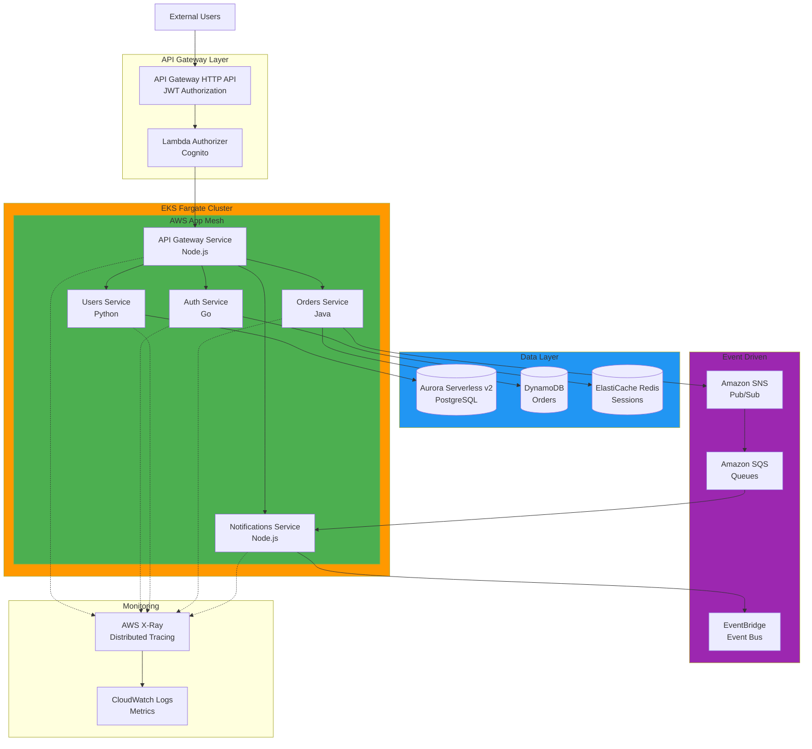

## 🏗️ High-Level Architecture

```mermaid
graph TB
    Users[External Users]
    
    subgraph Gateway["API Gateway Layer"]
        APIGW[API Gateway HTTP API<br/>JWT Authorization]
        Lambda[Lambda Authorizer<br/>Cognito]
    end
    
    subgraph EKS["EKS Fargate Cluster"]
        subgraph AppMesh["AWS App Mesh"]
            API[API Gateway Service<br/>Node.js]
            Auth[Auth Service<br/>Go]
            UsersService[Users Service<br/>Python]
            Orders[Orders Service<br/>Java]
            Notif[Notifications Service<br/>Node.js]
        end
    end
    
    subgraph Data["Data Layer"]
        Aurora[(Aurora Serverless v2<br/>PostgreSQL)]
        DynamoDB[(DynamoDB<br/>Orders)]
        ElastiCache[(ElastiCache Redis<br/>Sessions)]
    end
    
    subgraph Messaging["Event Driven"]
        SNS[Amazon SNS<br/>Pub/Sub]
        SQS[Amazon SQS<br/>Queues]
        EventBridge[EventBridge<br/>Event Bus]
    end
    
    subgraph Observability["Monitoring"]
        XRay[AWS X-Ray<br/>Distributed Tracing]
        CloudWatch[CloudWatch Logs<br/>Metrics]
    end
    
    Users --> APIGW
    APIGW --> Lambda
    Lambda --> API
    
    API --> Auth
    API --> UsersService
    API --> Orders
    API --> Notif
    
    UsersService --> Aurora
    Orders --> DynamoDB
    Auth --> ElastiCache
    
    Orders --> SNS
    SNS --> SQS
    SQS --> Notif
    Notif --> EventBridge
    
    API -.-> XRay
    Auth -.-> XRay
    UsersService -.-> XRay
    Orders -.-> XRay
    Notif -.-> XRay
    
    XRay --> CloudWatch
    
    style EKS fill:#FF9900
    style AppMesh fill:#4CAF50
    style Data fill:#2196F3
    style Messaging fill:#9C27B0
```
