# Architecture Diagrams - Serverless Microservices on EKS

Comprehensive Mermaid diagrams for the EKS Fargate microservices architecture.

## 1. Overall Microservices Architecture

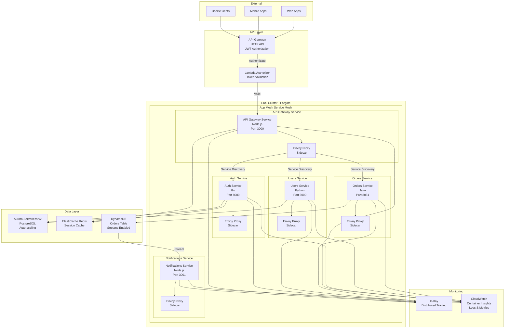

## 2. Service Mesh - AWS App Mesh

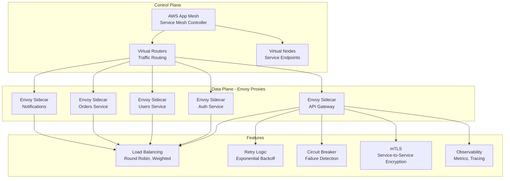

## 3. Request Flow with Service Mesh

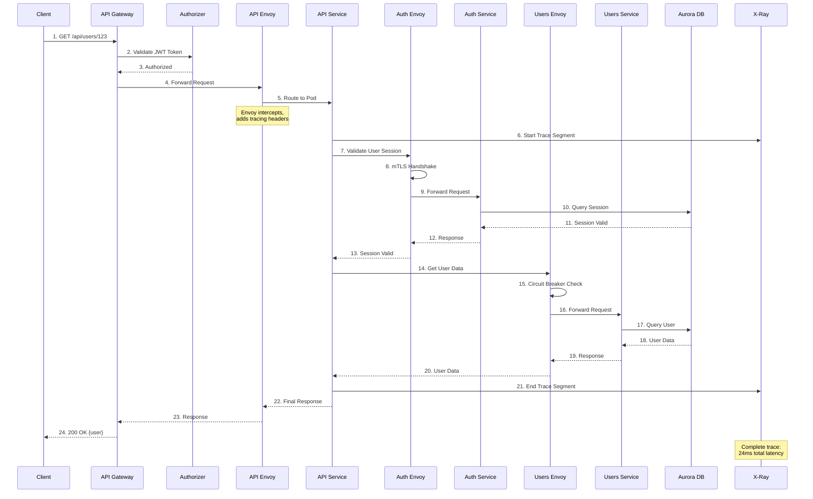

## 4. EKS Fargate Pod Architecture

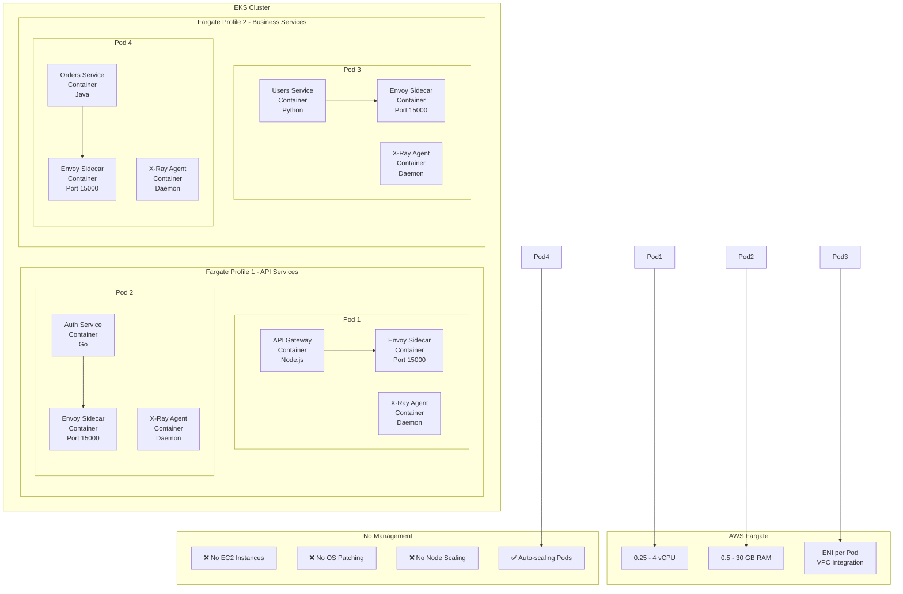

## 5. Auto-Scaling Strategy

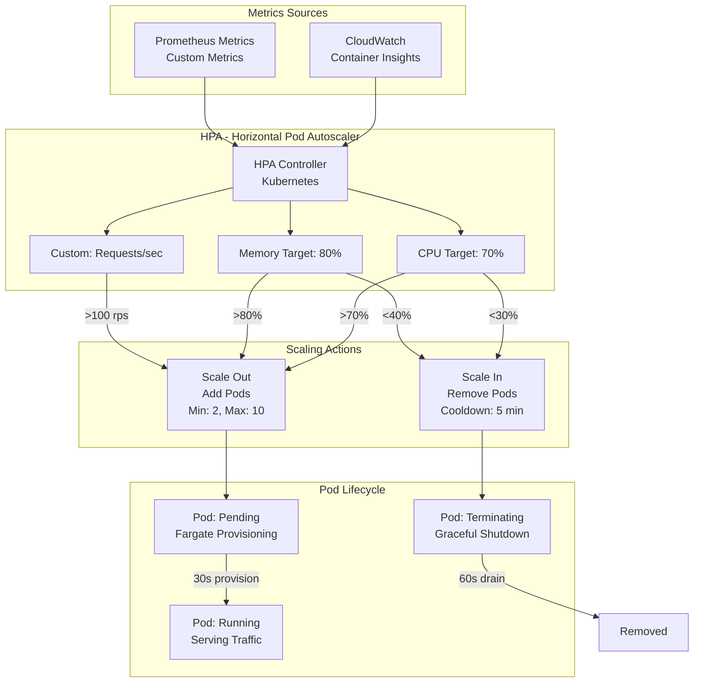

## 6. DynamoDB Streams to Notifications

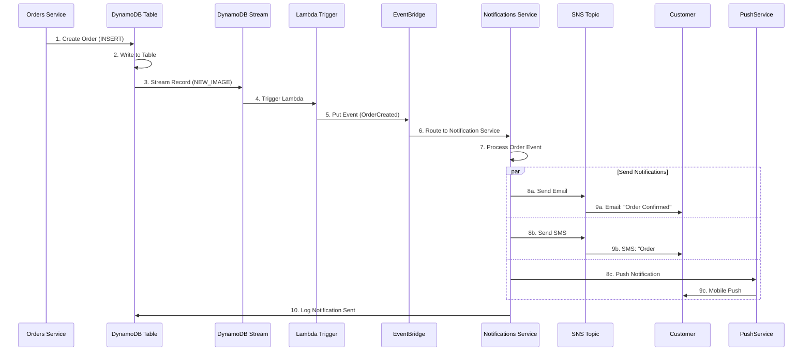

## 7. Observability - X-Ray Tracing

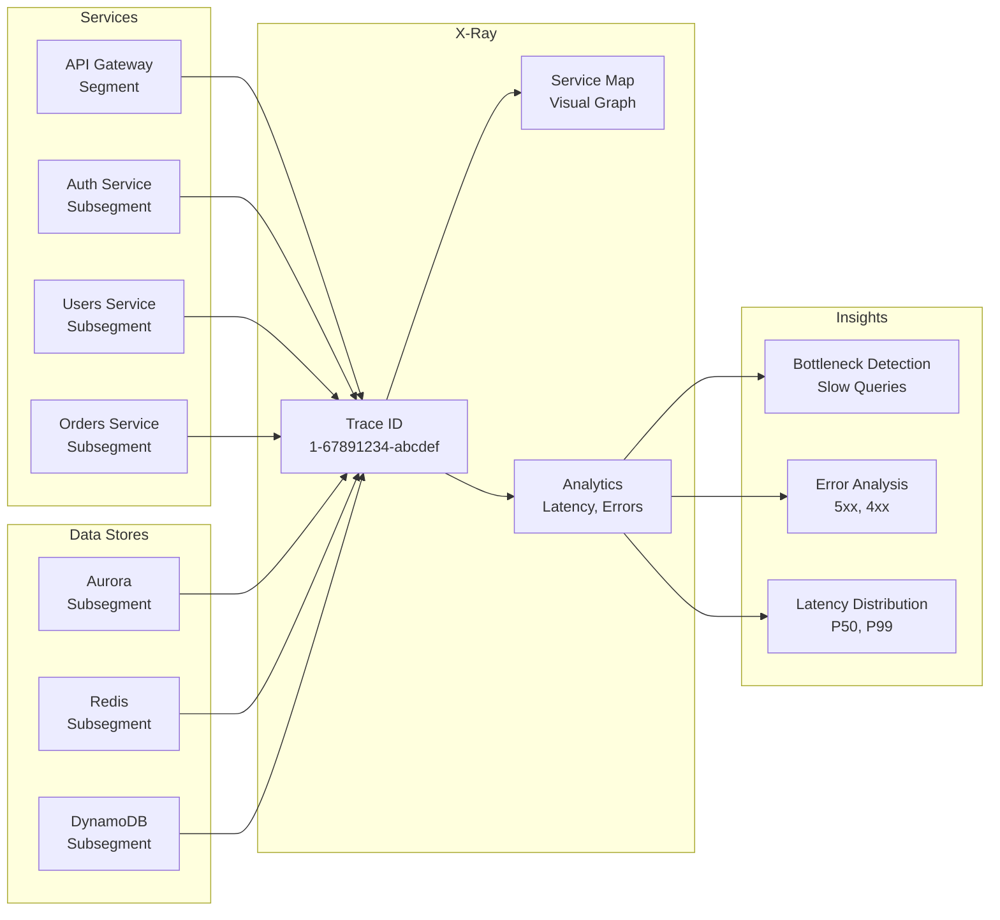

## 8. Security Architecture

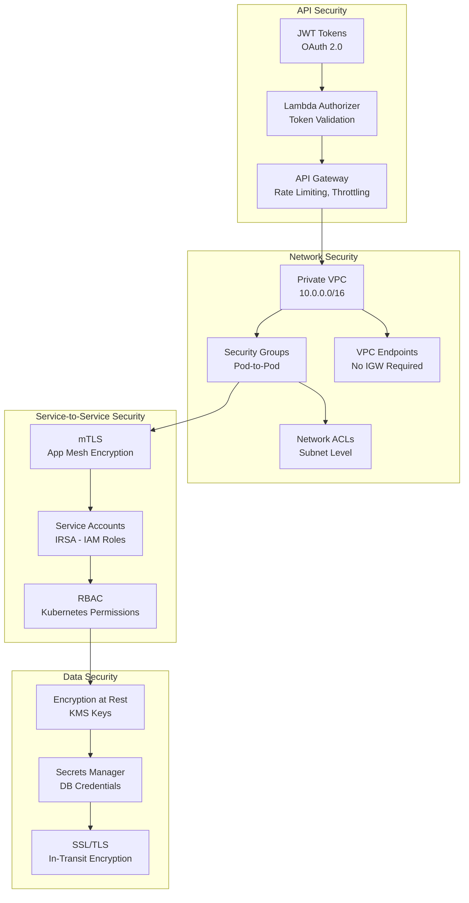

## 9. Deployment Pipeline

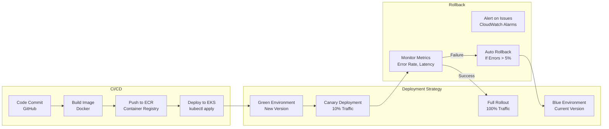

## 10. Cost Optimization

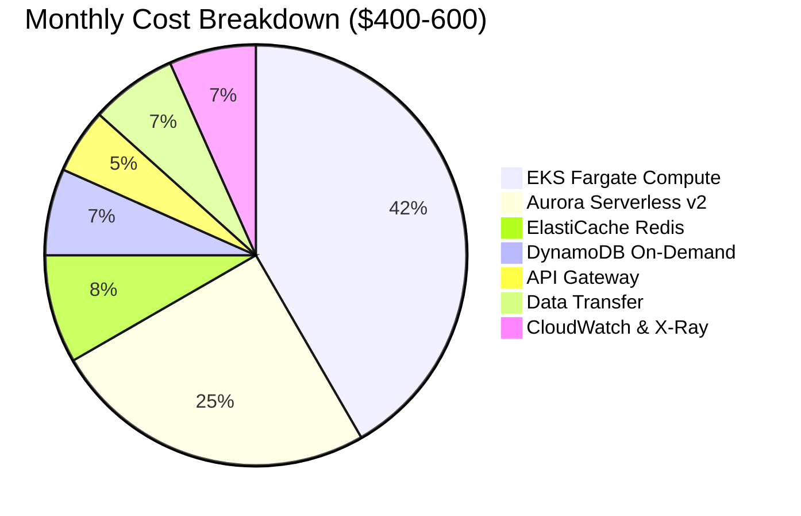

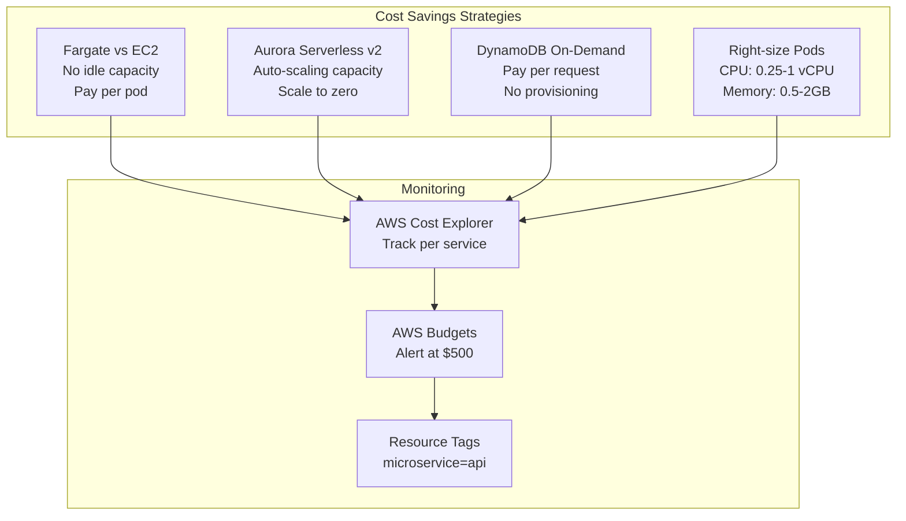

---

## Key Features

### 1. Serverless Kubernetes
- **EKS Fargate**: No EC2 management
- **Auto-scaling**: HPA based on metrics
- **5 Microservices**: Polyglot architecture

### 2. Service Mesh
- **AWS App Mesh**: Envoy sidecar proxies
- **mTLS**: Service-to-service encryption
- **Traffic Management**: Load balancing, retries, circuit breakers

### 3. Data Layer
- **Aurora Serverless v2**: Auto-scaling PostgreSQL
- **ElastiCache Redis**: Session management
- **DynamoDB**: Orders with Streams

### 4. Observability
- **X-Ray**: Distributed tracing
- **Container Insights**: Logs and metrics
- **Service Map**: Visual dependency graph

### 5. Security
- **JWT Authorization**: Lambda authorizer
- **IRSA**: IAM roles for service accounts
- **Network Isolation**: Private VPC, security groups

---

**Author**: Rahul Ladumor  
**License**: MIT 2025
